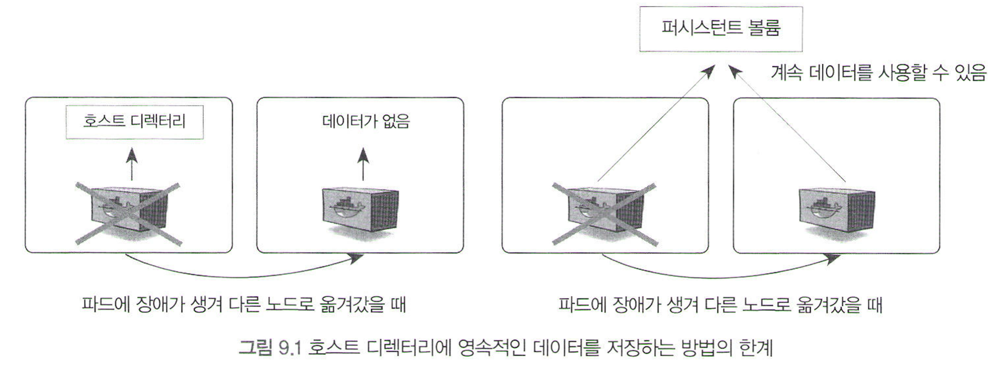
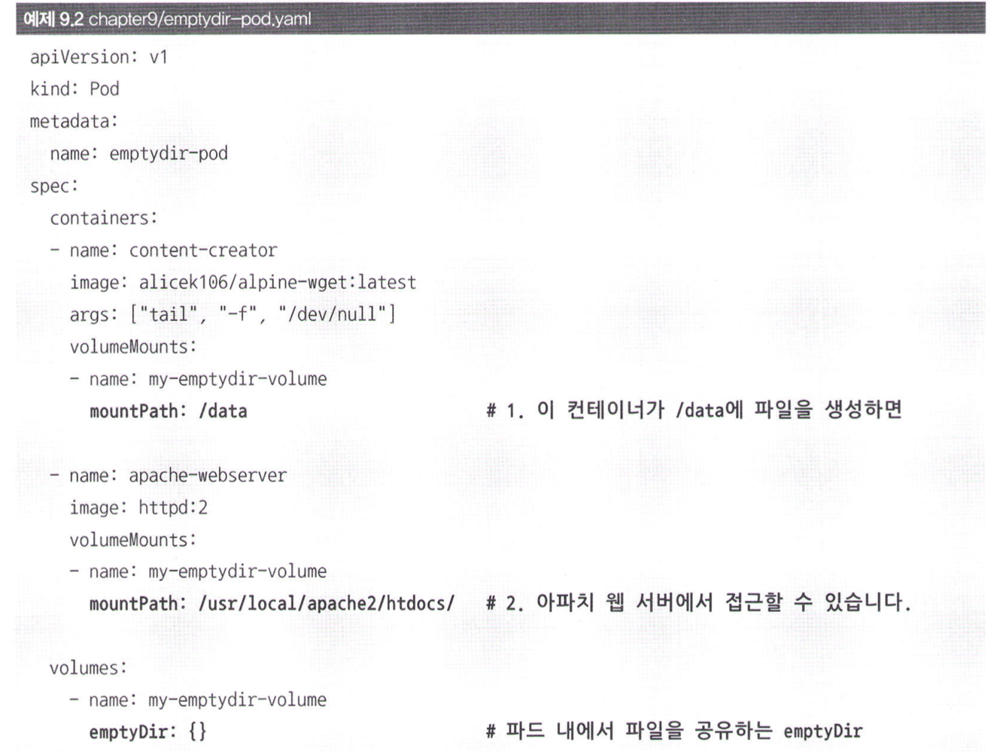
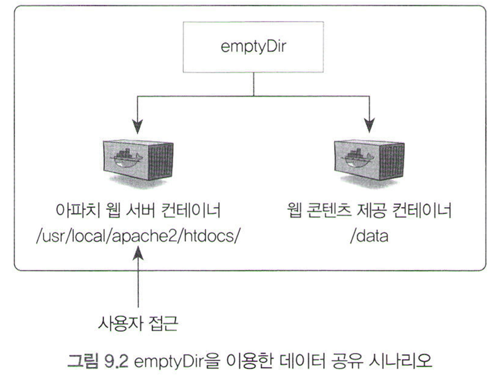

# 9.1 로컬 볼륨: hostPath, emptyDir

# 서론

1. 상태가 있는(stateful) 애플리케이션: 파드 내부에서 특정 데이터를 보유해야하는 앱. 예) 데이터베이스
    
    ↔ (지금까지 본 거) 상태가 없는(stateless) 애플리케이션
    
2. 파드의 데이터를 영속적으로 저장하기 위한 방법 필요
    
    : 단일 컨테이너의 디렉터리를 호스트와 공유함으로써 데이터를 보존
    
    - `docker run - v` / `docker volume`
3. 클러스터 환경에서는 적합 X
    
    why? 특정 노드에서만 데이터를 보관해 저장 → 파드가 다른 노드로 옮겨가면 그 데이터 못 씀
    
4. 퍼시스턴트 볼륨(Persistent Volume): 워커 노드들이 네트워크상에서 스토리지를 마운트해 영속적으로 데이터를 저장 → 어느 노드에서도 접근해 사용 가능
    
    예) NFS, AWS의 EBS(Elastic Block Store), Ceph, GlusterFS, 쿠버네티스 자체 제공
    

# 본론

- 로컬 볼륨: 볼륨을 간단히 사용해보기
    - 자주 사용 X
    - YAML 파일에서 볼륨 정의하고 사용하는 거 연습

## 9.1.1 워커 노드의 로컬 디렉터리를 볼륨으로 사용: hostPath

→ 호스트와 볼륨을 공유하기 위해 사용

- 파드의 컨테이너 내부로 들어가 /etc/data 디렉터리에 파일 생성 → 호스트의 /tmp 디렉터리에 파일 저장됨
- 일반적으로 바람직하지 않음! (장애 대비 불가)
    - 그러나 모든 노드에 배치해야 하는 특수한 파드의 경우에 유용하게 사용할 수 있음
        
        예) CAdvisor(모니터링 툴)을 쿠버네티스의 모든 워커 노드에 배포
        

## 9.1.2 파드 내의 컨테이너 간 임시 데이터 공유: empthDir

→ 파드의 컨테이너 간에 볼륨을 공유하기 위해 사용

- 실행되는 도중에만 필요한 휘발성 데이터를 각 컨테이너가 함께 사용할 수 있도록 임시 저장 공간 생성
- 비어있는(empty) 상태로 생성 & 파드 삭제되면 저장된 데이터도 함께 삭제

- 아파치 웹 서버의 루트 디렉터리(htdocs)를 emptyDir에 마운트 & 이 디렉터리를 content-creator 컨테이너의 /data 디렉터리와 공유
- content-creator 컨테이너 내부로 들어가 /data 디렉터리에 웹 콘텐츠 생성 → 아파치 웻 서버 컨테이너의 htdocs 디렉터리에도 동일하게 웹 콘텐츠 파일이 생성

- 이 외의 예)
    - 깃허브 소스코드를 받아와 emptyDir을 통해 애플리케이션 컨테이너에 공유해주는 사이드카 컨테이너
    - 설정 파일을 동적으로 갱신하는 컨테이너를 파드에 포함