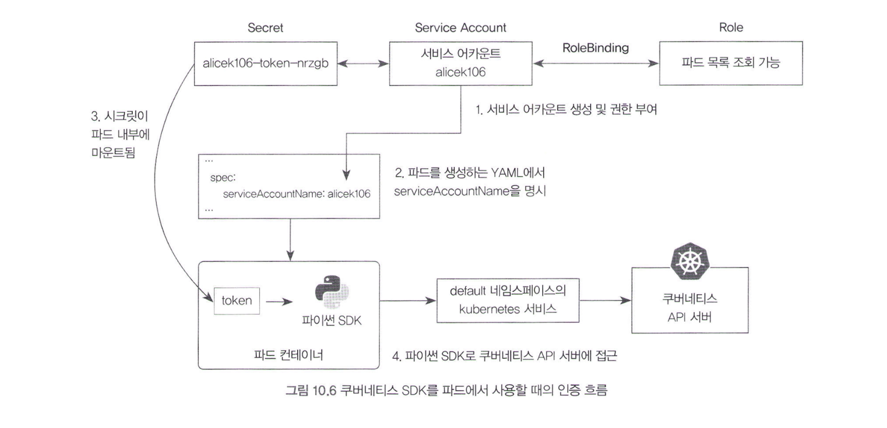

## 10.3 쿠버네티스 API 서버에 접근

### 10.3.1 서비스 어카운트의 시크릿을 이용해 쿠버네티스 API 서버에 접근

- `kubectl` 대신 HTTP REST API로 쿠버네티스의 기능을 제어할 수 있음
    - 보통 자동으로 개방되기 때문에 별도 설정 필요 없음
    - 마스터 노드의 IP를 통해 접근할 수 있음 (보통 443, 6443번 포트 사용)
        - 443에서 알 수 있듯이 HTTPS 요청만 처리하도록 설정됨
- HTTPS 인증서: 사용자의 권한을 증명할 credential을 첨부해야 함
    - 서비스 어카운트의 시크릿: 클러스터 공개 인증서(ca.crt) + 네임스페이스(namespace) + 토큰(token)
    - 이 중 토큰을 JWT 인증에 사용함
        - 근데 시크릿은 base64 인코딩 되어있으므로 디코딩 후 Authorization 헤더에 Bearer 토큰으로 넣어줌
        
        ```bash
        export SECRET_NAME=alicek106-token-nrzgb # 서비스 어카운트의 시크릿 이름
        export DECODED_TOKEN=$(kubectl get secret $SECRET_NAME \
        	-o jsonpath='{.data.token}' | base64 -d)
        echo $DECODED_TOKEN # 이게 디코딩된 토큰 값. 이걸 Bearer 토큰으로 사용하면 됨
        ```
        
        ```bash
        curl https://localhost:6443/api/v1/namespaces/default/services \
        	-k --header "Authorization: Bearer $DECODED_TOKEN"
        ```
        
- 이 때 토큰을 넣어준 서비스 어카운트는 보낼 요청에 대한 권한을 부여받은 상태여야 함
    - 롤/클러스터 롤을 통해서

### 10.3.2 클러스터 내부에서 kubernetes 서비스를 통해 API 서버에 접근

- 파드 내부에서도 k8s API 서버에 접근하고 권한을 인증할 방법이 필요할 때가 있음
    - e.g. 앞 장에서 예시로 등장한 Nginx 인그레스 컨트롤러
- `kubernetes` 서비스의 정체 (kubectl get svc 할 때 등장하는 기본적으로 생성되어있던 그 서비스)
    - 클러스터 내부에서 API 서버에 접근할 수 있도록 만들어놓은 서비스 리소스
    - 그래서 파드는 이 `kubernetes` 서비스를 통해 API 서버에 요청을 전달할 수 있음
- 그럼 파드도 권한 정보를 가지고 있어야 할텐데
    - 다행히 파드가 생성될 때 서비스 어카운트의 시크릿이 자동적으로 파드 내부에 마운트됨
    - 디플로이먼트도 마찬가지
    - 파드 내부의 특정 경로에 ca.crt, namespace, token 값이 파일 형태로 저장되어 있음

### 10.3.3 쿠버네티스 SDK를 이용해 파드 내부에서 API 서버에 접근

- 파드에서 실행되고 있는 애플리케이션을 통해서 API 서버에 접근하고자 한다면
    - e.g. FastAPI 컨테이너에서 k8s API 서버를 제어하고 싶다면?
    - 파이썬 SDK를 사용하여 FastAPI 애플리케이션에서 k8s API 서버에 접근 가능



1. 서비스 어카운트 생성 및 권한 부여
2. 파드를 생성하는 YAML에서 서비스 어카운트 명시
    
    ```yaml
    apiVersion: v1
    kind: Pod
    metadata:
    	name: k8s-python-sdk
    spec:
    	serviceAccountName: alicek106 # 서비스 어카운트 이름
    	containers:
    		- name: k8s-python-sdk
    			image: alicek106/k8s-sdk-python:latest
    ```
    
3. 파드 내부에 마운트된 시크릿 확인
    
    ```bash
    kubectl exec -it k8s-python-sdk bash
    ls /var/run/secrets/kubernetes.io/serviceaccount/
    ```
    
4. SDK로 API 서버 접근
    
    ```python
    import kubernetes
    
    # 파드 내부에 마운트된 서비스 어카운트의 토큰과 인증서를 불러옴
    kubernetes.config.load_incluster_config()
    
    try:
    	print('Trying to list service')
    	result = kubernetes.client.CoreV1Api().list_namespaced_service(namespace='default')
    	for item in result.items:
    		print(f"-> {item.metadata.name}")
    except kubernetes.client.rest.ApiException as e:
    	print(e)
    	
    print('---')
    
    try:
    	print('Trying to list pod')
    	result = kubernetes.client.CoreV1Api().list_namespaced_pods(namespace='default')
    	for item in result.items:
    		print(item.metadata.name)
    except kubernetes.client.rest.ApiException as e:
    	print(e)
    ```
    
    - 근데 앞의 예제에서 파드 목록 출력 권한을 설정을 하지 않았기 때문에 서비스는 정상 출력되지만 파드는 403 Forbidden 뜨면서 거절될 것임
