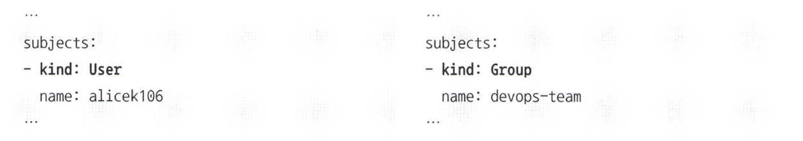

# 10.6 유저(User)와 그룹(Group)의 개념

어카운트 외에도 User, Group이라는 개념이 있다. User는 실제 사용자, Group은 여러 User들을 모아놓은 집합이다. 롤 바인딩, 클러스터 롤 바인딩을 정의하는 YAML 파일의 kind 값에는 ServiceAccount 대신에 User나 Group을 사용할 수 있다.





ServiceAccount라는 오브젝트가 있는데 User와 Group 이 왜 필요할까?

k8s에서 user는 사용자를 나타내는 개념이고, serviceaccount도 유저의 한 종류이다. 그럼에도 사람이라는 객체는 유저라는 개념으로 추상화해 사용되기 때문에 k8s 내부에서는 사용자는 user라는 개념으로 취급한다. 

<aside>
❗

k8s에서는 user나 group이라는 오브젝트가 없으므로 kubectl get user, kubectl group 같은 명령어를 사용할 수 없다.

</aside>

User, Group의 개념을 자세히 살펴보기 위해 service account의 권한이 없을 때 출력되는 에러 내용을 보겠다.

```bash
$ kubectl get services --as system:serviceaccount:default:alicek106
Error from server (Forbidden): services is forbidden: User "system:serviceaccount:default:alicek106" cannot list resource "services" in API group "" in the namespace "default"
```

—as에 사용한 표현은 service account를 지칭하는 고유한 user 이름이다. 따라서 에러에서도 똑같이 표현되며 user의 권한이 없다는 내용을 출력했다. service account를 생성하면 system:serviceaccount:<네임스페이스 이름>:<서비스 어카운트 이름> 순서로 user 이름으로 serviceaccount를 지칭할 수 있다. 

```yaml
subjects:
  - kind: User
    name: **system:serviceaccount:default:alicek106**
    namespace: default
roleRef:
  kind: Role
  ...
```

Group은 user들의 집합이다. k8s에서 사용할 수 있는 대표적인 Group은 service account 집합인 system:serviceaccounts로 시작하는 그룹이다. 이 그룹은 모든 네임스페이스에 속하는 모든 service account가 속해 있는 그룹이다. 이에 따라 네임스페이스에 상관없이 모든 serviceaccount에 권한을 부여하려면 클러스터 롤 바인딩의 YAML 파일에서 kind:Group을 명시하되 그룹이름을 system:serviceaccounts로 입력한 다음 적용하면 된다.

```yaml
apiVersion: rbac.authorization.k8s.io/v1
kind: ClusterRoleBinding
metadata:
  name: service-reader-rolebinding
subjects:
  **- kind: Group
    name: system:serviceaccounts**
roleRef:
  kind: ClusterRole  # 클러스터 롤 바인딩에서 연결할 권한은 클러스터 롤이어야 한다.
  name: service-reader
  apiGroup: rbac.authorization.k8s.io

```

특정 네임스페이스의 모든 service account를 의미하는 것은 system:serviceaccounts:<네임스페이스 이름>이 있다. system:serviceaccounts:default라는 이름의 그룹에 권한을 부여하면 default 네임스페이스의 모든 service accuont에 권한이 부여된다.

- system:authenticated, api 서버 인증에 성공한 그룹
- system:unauthenticated, 인증에 실패한 그룹
- system:anonymous, 인증에 실패한 유저

### 다양한 인증 방법에서의 User, Group

k8s의 인증 방법에서 service account의 secret token만 존재하는 것은 아니다.

ex) kubeconfig 파일에 기본적으로 설정돼 있던 인증 방법인 x509 인증서, 별도의 인증 서버를 사용하면 깃허브 계정, 구글 계정 LDAP 데이터 등을 사용 가능

별도의 인증 방법을 사용할 때는 User와 Group을 더 특별하게 사용한다.


위와 같이 팀 Devops의 개발자 전원에게 권한을 부여할 경우와 개발자 Carol에게 개인적으로 권한을 부여하는 경우에 롤바인딩을 정의한다. Github 조직의 팀을 Group에, 깃허브 사용자 이름을 User에 매칭했지만 이는 절대적인 규칙은 아니다. 인증서버나 API 서버에서 따로 설정 가능하기 때문이다. 따라서 깃허브 사용자 이름이 아닌 깃허브 이메일 이름을 유저로 매칭해 k8s에 사용하는 것도 가능하다.

