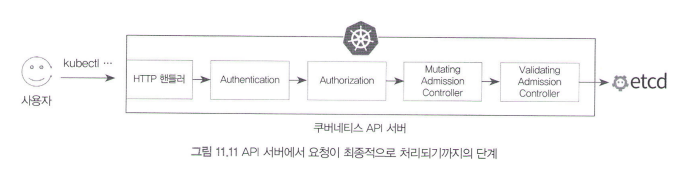

# 11.1.5 - 11.1.6

## 11.1.5 ResourceQuota와 LimitRange

Q. 여러 개발팀이 쿠버네티스에서 개발 및 테스트를 진행해야한다면 어떻게 쿠버네티스 환경을 구성해야 할까?

A1. 개발팀마다 쿠버네티스 클러스터 하나씩 제공하기

- 관리 번거로움
- 클러스터 프로비저닝 비용 높아짐

A2. RBAC(Role-based Access Control) 설정

- 개발팀마다 네임스페이스를 생성하고 이 안에서만 쿠버네티스 API를 사용
- 특정 네임스페이스에서 자원을 과도하게 사용하면 다른 네임스페이스의 자원 부족 가능성 → ResourceQuota와 LimitRange로 자원 사용량 관리

### 11.1.5.1 ResourceQuota로 자원 사용량 제한

**ResourceQuota**

- 정의: 특정 네임스페이스에서 사용할 수 있는 자원 사용량의 합을 제한할 수 있는 쿠버네티스 오브젝트
- 기능
    - 네임스페이스에서 할당할 수 있는 자원(CPU, 메모리, PV 클레임의 크기, 컨테이너 내부 임시 스토리지) 총합 제한
    - 네임스페이스에서 생성할 수 있는 리소스(서비스, 디플로이먼트 등)의 개수 제한
- 생성
    - 네임스페이스 별로 ResourceQuota 리소스를 생성 (default는 생성 X)
    
    ```yaml
    apiVersion: v1
    kind: ResourceQuota
    metadata:
      name: resource-quota-example
      namespace: default
    spec:
      hard:
        requests.cpu: "1000m"
        requests.memory: "500Mi"
     	limits.cpu: "1500m"
    	limits.memory: "1000Mi"
    ```
    
    ```bash
    # 생성
    kuectl apply -f resource-quota.yaml
    
    # 정보 출력
    kubectl describe quota
    ```
    
    - ResourceQuota 생성 이전에 존재하던 파드들이 이미 자원을 한계치보다 많이 사용하고 있다고 해서 기존의 파드가 종료되지는 않음
- 예시
    - ResourceQuota가 생성된 상태에서 메모리를 과도하게 사용하는 파드를 하나 생성 → 생성 실패
    
    ```bash
    kubectl run memory-over-pod --image=nginx --generator=run-pod/v1 \
    --requests='cpu=200m,memory=300Mi' --limits='cpu=200m,memory=3000Mi'
    
    ```
    
    - 디플로이먼트를 통해 파드 생성 → 디플로이먼트는 정상 생성되지만 해당 디플로이먼트로 생성된 파드가 존재하지 않음
        
        
        
        - 파드를 생성하는 주체: 디플로이먼트 X 레플리카셋O
        - 디플로이먼트 리소스는 직접 파드를 생성하지는 않으므로, 파드 생성 거부에 대한 에러 로그는 레플리카셋에 남음
        - 레플리카셋은 지속해서 라벨 셀렉터에 해당하는 파드를 생성하려고 시도하므로 ResourceQuota의 정보가 업데이트되거나 가용 자원이 발생하면 파드를 정상적으로 생성
        - 특정 상태를 유지시키려는 동작이 실패했을 때는 지수함수의 간격을 두고 동일한 동작 재시도

**ResourceQuota로 리소스 개수 제한하기**

- 자원 사용량 뿐만 아니라 리소스 개수 제한 가능
    - 디플로이먼트, 파드, 서비스, 시크릿, 컨피그맵, PV 클레임 등의 개수
    - NodePort 타입의 서비스 개수, LoadBalancer 타입의 서비스 개수
    - QoS 클래스 중에서 BestEffort 클래스에 속하는 파드의 개수
- 생성
    - YAML 파일에 count/pod와 같은 형식으로 정의
    
    ```yaml
    apiVersion: v1
    kind: ResourceQuota
    metadata:
      name: resource-quota-example
      namespace: default
    spec:
      hard:
        requests.cpus: "1000m"
        requests.memory: "500Mi"
	limits.cpu: "1500m"
        limits.memory: "1000Mi"
        count/pods: 3
        count/services: 5
    ```
    
    - count/<오브젝트 이름> 또는 <API 그룹 이름>
        - pods나 secrets 등은 코어 api 그룹에 해당하므로 별도 API 그룹명을 명시하지 않음
    - default 네임스페이스에서 최대 파드 3개, 서비스 5개를 생성할 수 있으며 그 이상 생성할 경우 API 요청이 거절됨
    
    ```bash
    Error from server: pods "over-pod" is forbidden: exceed quota
    ```
    

**ResourceQuota BestEffort 클래스의 파드 개수 제한하기**

- ResourceQuota를 사용하면 Request/Limit가 모두 설정돼있지 않아서 노드의 자원을 제한 없이 사용할 수 있는 파드(BestEffort 클래스의 파드 ) 개수 제한 가능

```yaml
apiVersion: v1
kind: ResourceQuota
metadata:
    name: besteffort-quota
    namespace: default
spec:
    hard:
    count/pods: 1
scopes:
  - BestEffort
```

- scopes는 필수 항목은 아니지만 BestEffort/Terminating/NotTerminating/NotBestEffort 같은 파드의 상태를 값으로 입력할 수 있음
- BestEffort 클래스의 파드는 아무런 자원을 할당하지 않은 경우에 해당하므로 hard에서 자원 제한설정과 연결되어 사용하지 않음
- ResourceQuota에 limits.cpu, limits.memory 등을 이용해 네임스페이스에서 사용 가능한 자원의 합을 설정했다면 파드를 생성할 때 해당 항목을 정의해야하고, 그렇지 않으면 에러가 반환

### 11.1.5.2 LimitRange로 자원 사용량 제한

**LimitRange**

- 특정 네임스페이스 자원의 범위 또는 기본값을 지정할 수 있는 쿠버네티스 오브젝트
- 용도
    - 파드 컨테이너에 CPU나 메모리 할당량이 설정돼 있지 않은 경우, 컨테이너에 자동으로 기본 Requests 또는 Limits 값을 설정할 수 있음
    - 파드 또는 컨테이너의 CPU, 메모리, PV 클레임 스토리지 크기의 최솟값/최댓값을 설정할 수 있음
- 네임스페이스에 종속되는 오브젝트, 기본적으로 어떤 LimitRange도 생성돼 있지 않음
- 생성
    
    ```yaml
    apiVersion: v1
    kind: LimitRange
    metadata:
    	name: mem-limit-range
    spec:
    	limits:
    	- default: # 1. 자동으로 설정될 기본 Limits 값
    			memory: 256Mi
    			cpu: 200m
    		defaultRequest: # 2. 자동으로 설정될 기본 Request 값 
    			memory: 128Mi
    			cpu: 100m
    		max: # 3. 자원 할당량의 최댓값
    			memory: 1Gi
    			cpu: 1000m
    		min: # 4. 자원 할당량의 최솟값
    			memory: 16Mi
    			cpu: 50m
    		type: Container # 5. 각 컨테이너에 대해서 적용
    ```
    
    - maxLimitRequestRatio 항목을 사용하여 오커커밋되는 자원에 대한 비율을 제한할 수도 있음
    - 1로 설정함으로써 Guranateed 클래스의 파드만을 생성하도록 강제할 수 있음
    
    ```yaml
    apiVersion: v1
    kind: LimitRange
    metadata:
    	name: limitrange-ratio
    spec:
    	limits:
    	- maxLimitRequestRatio:
    			memory: 1.5
    			cpu: 1
    		type: Container
    ```
    

## ResourceQuota, LimitRange의 원리: Admission Controller

**Admission Controller**

- 사용자의 API 요청이 적절한지 검증하고, 필요에 따라 API 요청을 변형하는 단계



- kubectl 등으로부터 전송된 API가 부적절하면 해당 단계에서 API 요청을 거절할 수도 있고, 필요하다면 API 요청에 포함된 파라미터를 변경할 수도 있음
- ServiceAccount, ResourceQuota, LimitRange 등
- (1) 검증(Validation) 단계 + (2) 변형(Mutating) 단계
    - API 요청 검사
    - API 요청 적절히 수정
- 커스텀 어드미션 컨트롤러를 직접 구현해 쿠버네티스에 등록할 수 있음
- 파드의 어노테이션에 따라서 별도의 사이드카 컨테이너를 자동적으로 추가하는 주입 패턴을 어드미션 컨트롤러를 통해 구현
    - 서비스 메쉬 솔루션 Istio 또한 어드미션 컨트롤러를 통해 파드에 프롯기 사이드카 컨테이너 주입하는 방법을 사용

**시나리오**

- 4, 5번이 어드미션 컨트롤러가 동작하는 관계
1. 사용자가 kubectl apply -f pod.yaml와 같은 명령어로 API 서버에 요청을 전송
2. x509 인증서, 서비스 어카운트 등을 통해 인증단계 거침
3. 롤, 클러스터 롤 등을 통해 인증 단계를 거침
4. 어드미션 컨트롤러인 ResourceQuda는 해당 파드의 자원 할당 요청이 적절한지 검증 → 설정된 네임스페이스의 최대 자원 할당량을 초과한다면 거절 
5. 해당 API 요청에 포함된 파드 데이터에 자원 할당이 설정되지 않은 경우, 어드미션 컨트롤러인 LimitRange는 파드 데이터에 CPU 및 메모리 할당 기본값을 추가함으로써 원래의 파드 생성 API 데이터 변형
