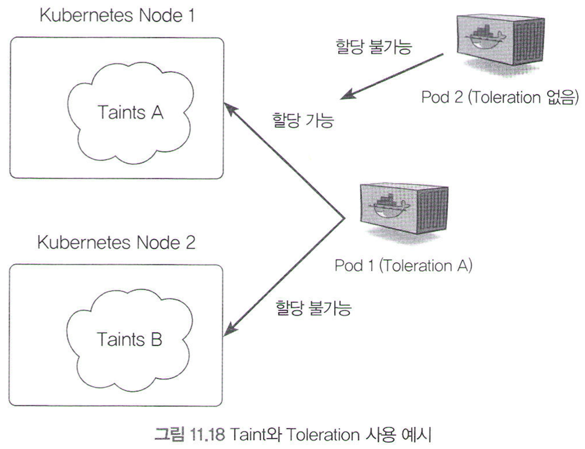
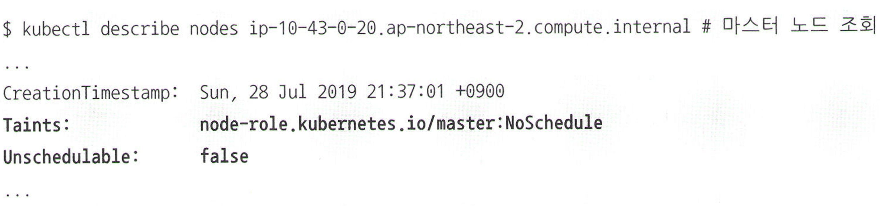
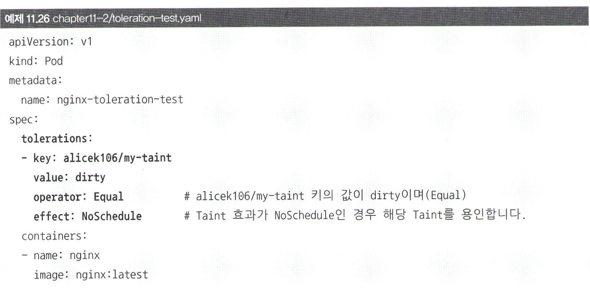
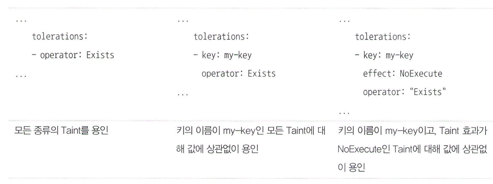
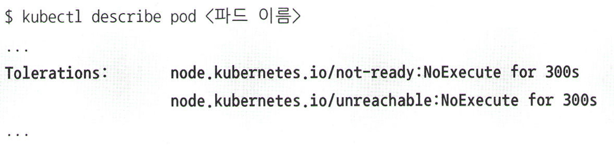

# 11.2.4 Taints와 Tolerations 사용하기 (얼룩과 용인)

### 노드에 얼룩이 졌지만, 이를 용인할 수 있는 파드만 해당 노드에 할당

- 특정 노드에 얼룩(Taints) 지정 → 해당 노드에 파드 할당 막음
- 파드에 Tolerations 설정 → 얼룩 있는 노드에서 파드 할당 가능



### 노드에 얼룩 묻히기

1. 여러분이 설정
    
    ```bash
    # 얼룩 묻히기
    kubectl taint nodes nodename key=value:effect
    kubectl taint nodes ip-10-43-0-30.ap-northeast-2.compute.internal alicek106/my-taint-dirty:NoSchedule
    
    # 얼룩 지우기 (라벨과 마찬가지로 - 붙이기)
    kubectl taint nodes nodename key:effect-
    ```
    
    - 기본적으로 키-값 형태
    - `effect`(Taint 효과)
        - `NoSchedule`: 파드를 스케줄링하지 않음 → 기존에 실행 중이던 건 정상 동작
        - `NoExecute`: 파드의 실행 자체를 허용하지 않음 → 기존 실행 중이던 것도 종료시킴
            - 단, 파드가 디플로이먼트나 레플리카셋 등과 같은 리소스로부터 생성됐다면 파드는 다른 노드로 옮겨갈 것; 파드의 퇴거(Eviction)
            - <복습> 레플리카셋이 라벨 셀렉터가 일치하는 파드의 개수가 지정된 값보다 적다는 걸 인지 → 다른 노드에 새롭게 파드를 생성
        - `PreferNoSchedule`: 가능하면 스케줄링하지 않음
2. 특정 이벤트로 인해 쿠버네티스가 자동으로 설정
    - 마스터 노드에 기본적으로 설정된 Taint → 기본적으로 파드 생성하면 마스터 노드 아니고 워커 노드에 할당됨
        
        
        
        - `node-role.kubernetes.io/master:NoSchedule` 이라는 이름의 얼룩? Taints는 기본적으로 키-값 형태이지만 값을 생략 가능 → “”(빈 문자열) 값을 가지는 것으로 간주됨
        - `Unscehduable: false` → 스케줄링의 대상이 되는 노드
        - 마스터 노드 얼룩도 용인 가능하지만, 마스터 노드에서는 일반적으로 API 서버와 같은 핵심 컴포넌트만 실행하는 것이 바람직! (API 서버 파드에는 :NoExecute 용인이 설정되어있음)
    - 특정 문제가 발생한 노드에 대해서는 자동으로 `NoExecute` 얼룩 추가
        - NotReady: 아직 노드가 준비되지 않은 상태
        - Unreachable: 네트워크 불안정한 상태
        - memory-pressure: 메모리 부족
        - disk-pressure: 디스크 공간 부족

### 파드에서 노드의 얼룩 용인하기

1. YAML 파일로 용인
    
    
    
    - 용인의 종류
        
        
        
        - `operator: Equal` → 키와 값이 같을 때 용인
        - `operator: Exists` → 키와 값에 상관 없이 모두 용인(와일드카드 역할)
2. 쿠버네티스가 자동으로 용인 생성
    - 특정 문제가 발생한 노드에 대해서는 자동으로 추가된 `NoExecute` 얼룩에 해당하는 시간제한 용인 추가
        
        
        
        - tolerationSeconds: for 300s 와 같은 옵션 → 300초 동안은 해당 얼룩 용인 & 기본적으로는(정상 상태로 돌아오지 않으면) 300초 후에 옮겨가게 됨