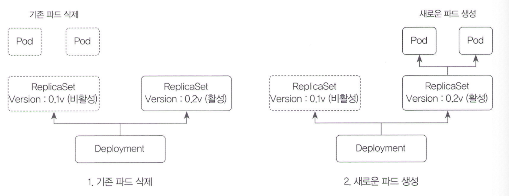
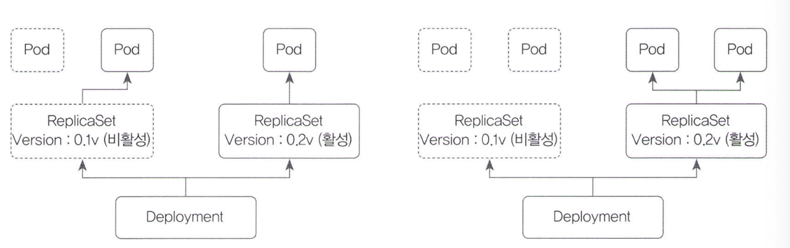
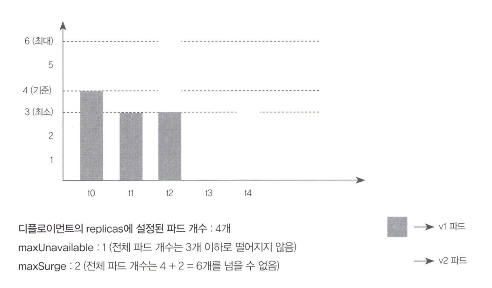
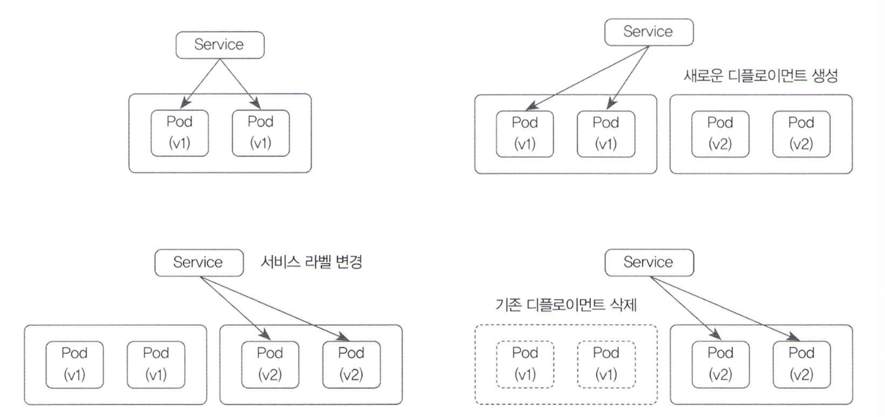
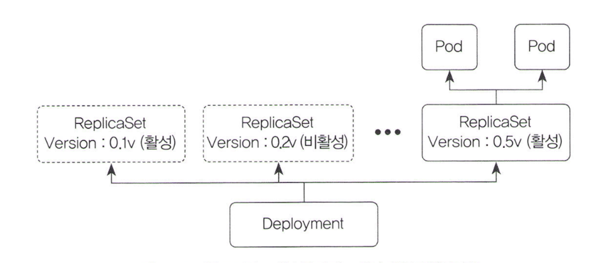

# 11.3.1 디폴로이먼트를 통해 롤링 업데이트

k8s에서 애플리케이션을 배포하려면?

kubectl apply -f로 디플로이먼트를 생성함으로써 여러 개의 파드를 배포할 수 있다. → 좀 더 발전 시 Spinnaker, Helm, Kustomize 등 지속적 배포 도구 사용 가능

하지만 안정적으로 배포하려면 기존 애플리케이션을 삭제하고 새로운 버전을 배포해야할 수도 있고, 이전 버전의 애플리케이션으로 롤백 해야 할 수 있으므로 많은 부분 신경써야한다. 애플리케이션이 중단돼어도 괜찮다면? 상관없다.

 k8s에서는 안정적으로 배포할 수 있도록 여러 기능을 제공한다. 애플리케이션이 점진적으로 배포되도록 롤링 업데이트 기능, 배포된 애플리케이션의 버전을을 내부적으로 저장해서 언제든 롤백 가능하도록 도와주는 기능, 배포된 파드의 애플리케이션이 사용자의 요청을 처리할 준비가 됐는지 확인 가능하다. 이번 챕터에서는 디플로이먼트의 롤링 업데이트를 사용하는 방법을 알아보고 파드의 생애 주기를 설명할 것이다.

### 디폴로이먼트를 이용한 레플리카셋의 버전 관리

보통 파드를 직접 생성 X(테스트, 개발 환경 아니면)

디플로이먼트를 생성 후 디플로이먼트에 속하는 레플리카셋이 파드를 생성(6.2 챕터에서 설명)



디폴로이먼트에서 변경 사항이 생기면 새로운 레플리카셋이 생성되고 그에 따른 새로운 버전의 애플리케이션이 배포된다. —record 옵션으로 변경 사항을 적용시 사용하던 레플리카셋의 정보는 히스토리에 기록된다.(언제든 롤백 가능)

```bash
$ kubectl apply -f deployment-v1.yaml --record
deployment.apps/nginx-deployment created

$ kubectl get pods
NAME                                READY   STATUS    RESTARTS   AGE
nginx-deployment-5f9fdfb85d-92bn7  1/1     Running   0          8s
nginx-deployment-5f9fdfb85d-dbhbw  1/1     Running   0          8s
nginx-deployment-5f9fdfb85d-gskjp  1/1     Running   0          8s

$ kubectl apply -f deployment-v2.yaml --record
deployment.apps/nginx-deployment configured

$ kubectl rollout history deployment nginx-deployment
deployment.extensions/nginx-deployment
REVISION  CHANGE-CAUSE
1         kubectl apply --filename=deployment-v1.yaml --record=true
2         kubectl apply --filename=deployment-v2.yaml --record=true
```

### 디폴로이먼트를 통한 롤링 업데이트 설정

일시적으로 멈춰도 된다? Recreate 방법 사용 가능(기존 버전의 파드를 모두 삭제 후 새롭게 파드를 생성)



이는 YAML의 strategy type 항목에서 설정 가능하다.

```bash
$ kubectl apply -f deployment-recreate-v1.yaml
deployment.apps/deployment-recreate created

$ kubectl get pods
NAME                                    READY   STATUS    RESTARTS   AGE
deployment-recreate-5f9fdfb85d-7kmjb    1/1     Running   0          26s
deployment-recreate-5f9fdfb85d-rxs5h    1/1     Running   0          26s
deployment-recreate-5f9fdfb85d-z2w4m    1/1     Running   0          26s

$ kubectl apply -f deployment-recreate-v2.yaml
deployment.apps/deployment-recreate configured

$ kubectl get pods
NAME                                    READY   STATUS        RESTARTS   AGE
deployment-recreate-5f9fdfb85d-7kmjb    0/1     Terminating   0          54s
deployment-recreate-5f9fdfb85d-rxs5h    0/1     Terminating   0          54s
deployment-recreate-5f9fdfb85d-z2w4m    0/1     Terminating   0          54s

```

하지만 삭제하고 생성하는 동안 사용자의 요청을 처리할 수 없으므로 적절하지 않을 수 있다. k8s에서는 파드를 조금씩 삭제하고 생성하는 롤링 업데이트를 제공한다. 롤링 업데이트 사용시 사용자의 요청을 처리할 수 있는 파드가 계속 존재해서 애플리케이션의 중단이 발생 x



롤링 업데이트의 세부 옵션: maxSurce, maxUnavailable(적절히 사용해 업데이트 속도 조절)

maxUnavailable: 롤링 업데이트 도중 사용 불가능한 상태가 되는 파드의 최대 개수를 설정(퍼센트)-default:25, 버림

maxSurge: 롤링 업데이트 도중 전체 파드의 개수가 디폴로이먼트의 레플리카 값보다 얼마나 더 많이 존재할 수 있는지 설정(퍼센트)-default-25, 반올림



롤링 업데이트 시 특정 순간에는 기존 버전과 새로운 버전이 공존하므로 각 컴포넌트들은 기존과 새로운 버전 중 어떠한 버전과 통신해도 시스템에 문제가 발생하지 않아야한다.

### 블루 그린 배포 사용하기

블루 그린 배포는 기존 버전의 파드를 그대로 놔두고 새로운 버전의 파드를 미리 생성해 둔 뒤 서비스의 라우팅만 변경하는 배포 방식이다. 롤링 업데이트와 달리 공존x, Recreate처럼 중단 시간이 발생하지 x

k8s에서 자체적으로 지원하는 것은 아니지만 기본 기능을 통해 사용할 수 있다.

