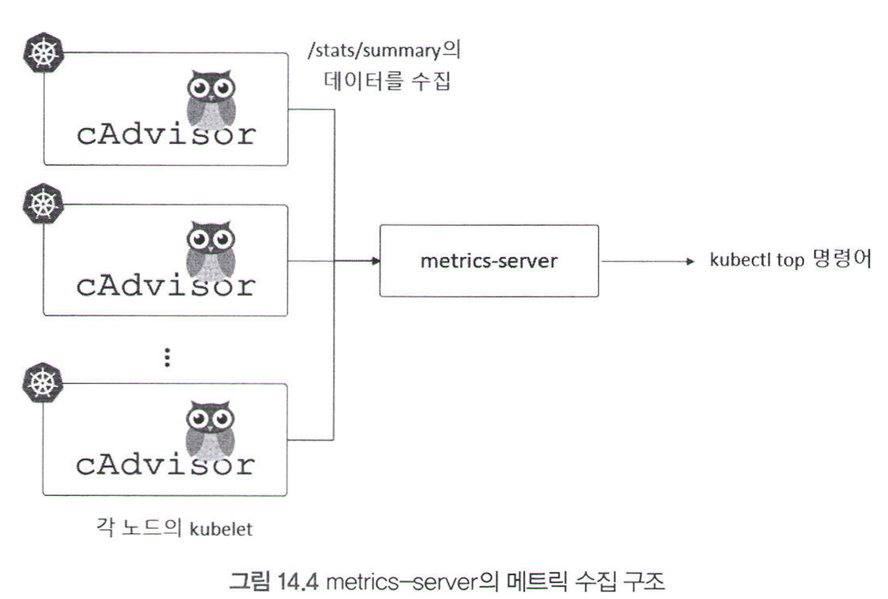
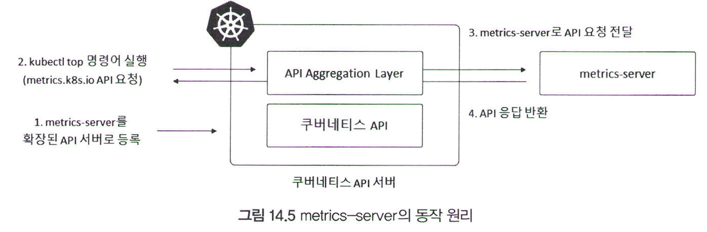

# 14.3 쿠버네티스 모니터링 기초

무료로 사용할 수 있는 프로메테우스 중심의 모니터링 시스템으로 기초를 공부해보자!
(근데 이제 애드온 기능 매우 빨리 개발되므로 책과 다른 부분 있을 수 있음)

## 14.3.1 metrics-server

- 쿠버는 모니터링 수집할 수 있는 **애드온(add-on)** 제공 (쿠버 자체적 모니터링 기능 X)
- metrics-server: 컨테이너와 인프라 레벨 메트릭 수집
    - 파드의 오토스케일링, 사용 중인 리소스 확인 등

### 파드의 리소스 확인

- `kubectl top`: 파드 또는 노드의 리소스 사용량 확인
    - 참고) `docker stats`: 호스트 모신에 존재하는 도커 컨테이너의 리소스 사용량 보여주는 명령어
    - 쿠버는 여러 개 노드로 구성돼 있으므로, **클러스터 내부의 메트릭을 모아서 제공하는 별도의 무엇인가**가 필요! 그 무엇인가가 바로 **metrics-server**
- metrics-server 설치
    1. 공식 깃허브 저장소의 YAML 파일 내려받기
    2. 디플로이먼트 부분에서 실행 옵션(args)에 `—kubelet-insecure-tls` 옵션 추가
        
        ```yaml
        $ vim components.yaml
        ...
        containers:
        name: metrics-server
        image: k8s.gcr.io/metrics-server/metrics-server:v0.3.7 
        imagePullPolicy : IfNotPresent
        args:
          - --cert-dir=/tmp 
          - --secure-port=4443
          - --kubelet-in sec ure-tls
        ...
        ```
        
    3. 수정된 YAML 파일로 설치!
        
        `kubectl apply -f components.yaml`
        
    4. kube-system 네임스페이스에 생성됨! (이제 `kubectl top` 명령어 사용 가능!)

## 14.3.2  metrics-server 동작 원리: APIService 리소스

모니터링 시스템 구축과 직접적 연관은 없지만, APIService 공부할 겸 이해해보자!

### 메트릭 확인해보기

- CAdvisor
    - kubelet(쿠버네티스의 노드 에이전트)이 자체적으로 내장하고 있음
    - 파드와 노드 메트릭을 반환하는 `/stats/summary`라는 엔드포인트를 제공
    - 그냥 바로 엔드포인트에 접근하면 실패!
        - kubelet으로부터 메트릭을 가져오기 위한 권한을 클러스터롤로 정의 → 서비스 어카운트에 연결 → 서비스 어카운트의 토큰을 curl 헤더에 포함시켜 요청해야 메트릭 확인 가능
- metrics-server 서비스 어카운트가 `nodes/stats` 라는 리소스에 접근할 수 있는 권한 이미 부여돼있음(아까 YAML 파일로 설치할 때 부여함)
    - 따라서, 서비스 어카운트 토큰을 curl 헤더에 포함시켜 요청하면 메트릭 확인 가능
    
    ```bash
    $ kubectl get secrets -n kube-system | grep metrics-server
    #{토큰 두둥 등장} ~~
    
    $ kubectl get secrets metrics-server-token-4n2ti -n kube-system -o jsonpath={.data.token} I base64 -d
    
    $ kubectl run --generator=run-pod/v1 -i --tty --rm debug --image=a1icek106/ubuntu:curl bash
    
    root@debug: /# curl https : I /10.40.0.10:10250/stats/summary -k -H "Authorization: Bearer {복사한 토큰}"
    ```
    
- 참고: 인증서 사용 허가 옵션
    - `curl`의 `-k` 옵션: HTTPS 통신 시 신뢰할 수 없는 인증서의 사용 허가
    - metrics-server 설치할 때 `--kubelet-insecure-tls` 옵션: kubelet 인증서의 신뢰 여부와 상관없이 통신



### metrics-server가 반환하는 메트릭은 어떠한 형태일까?


- API 서버가 응답한 것처럼 반환 ← metrics-server가 일종의 **확장된 API 서버** 역할을 하기 때문!
- 확장된 API 서버: API 서버의 스펙을 준수하는 별도의 서버를 구축한 뒤, 이를 쿠버네티스에 등록하면 마치 확장된 API 서버처럼 사용 가능!
- metrics-server에 의해 확장된 API는 **APIService**라고 하는 리소스를 사용해 쿠버네티스에 등록 가능!
    - APIService 리소스: 새로운 API를 확장해 사용하기 위해서는 어떠한 서비스에 접근해야하는가를 정의
    
    ```yaml
    apiVersion : apiregistration. k8s .to/v1 kind: APlService
    metadata:
      name: v1beta1.metrics.k8s.io 
    spec:
      service:
        name: netrics-server # [2] metrics-server라는 서비스 이름에 접근함으로써 
        namespace: kube-system # [t] kube-namespace에 존재하는
      group: metrics.k8s.io. # [3] metrics.kgs.io라는 이름의 API를 사용할 수 있다고 정의함
      version: v1beta1 # [4] API 버전은 v1beta1
    ...
    ```
    
    → `metrics.k8s.io`라는 이름의 API 호출하게 되면 API 서버(kube-apiserver) 아니고 metrics-server에서 처리하게 됨
    
- **API Aggregation**: 이러한 API 확장 방식
    - 별도의 외부 데이터 소스로부터 메트릭을 가져다 쓰거나 추가적 쿠버네티스 기능을 구현해야할 때 사용
    
    
    

## 14.3.3 kube-state-metrics

- kube-state-metrics: 쿠버네티스 리소스 상태에 관련된 메트릭을 제공하는 애드온
    - 파드의 상태가 Running인지, 디플로이먼트의 레플리카 개수가 몇 개인지 등
- 설치
    1. 깃허브에서 YAML 파일 내려받기
    2. `kubectl apply -f kube-state-metrics/examples/standard` 
- 메트릭 확인
    - curl 등으로 요청 보내면 관련 메트릭 바로 확인 가능
    
    
    

## 14.3.4 node-exporter

- node-exporter: 인프라 수준에서의 메트릭을 제공하는 exporter
    - 파일 시스템, 네트워크 패킷 등과 같이 호스트 측면에서의 다양하고 자세한 메트릭 제공
    - 참고) CAdvisor: 컨테이너 메트릭에 초점
- 설치
    1. kube-prometheus 등과 같은 깃허브 저장소에서 쿠버네트스용 node-exporter 매니페스트 내려받기
    2. `kubectl apply -f node-exporter`  
    3. monitoring이라는 네임스페이스에 생성됨!
- 메트릭 확인
    - node-exporte는 데몬셋으로 배포되므로 모든 노드에 파드가 하나씩 생성돼있음
    - 파드의 IP가 노드의 IP와 동일 ← node-exporter가 호스트 네트워크 모드로 실행되기 때문
        - 파드 스펙에 `hostNetwork`를 설정해주면 `docker run` 명령어의 `—net host`와 같은 효과
        - 노드의 IP에 접근할 수 있다면 node-exporter에도 접근 가능
    - kubectl run으로 임시용 파드를 생성하거나, 클러스터 노드에 직접 SSH로 접속해 노드의 IP 및 node-exporter의 기본 포트인 9100으로 요청 전송하면 다양한 메트릭 확인 가능!
    - 필요없는 메트릭은 node-exporter 데몬셋 YAML 실행 인자(args) 중 `—-no-collector`를 추가하여 수집 안 할 수 있음
    
    
