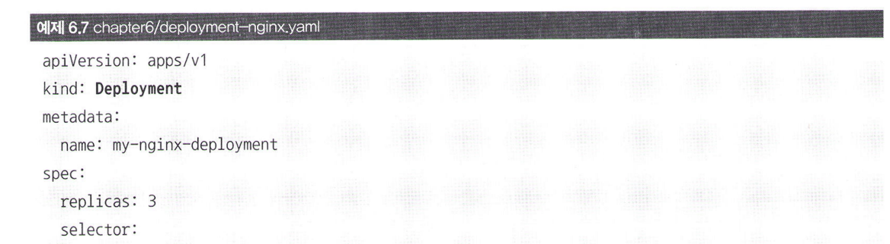

# 6.4 Deployment: 레플리카셋, 파드의 배포 관리

## 6.4.1 Deployment 사용하기

레플리카셋만으로 마이크로서비스 구조의 container를 구성할 수 없음. 레플리카셋을 YAML 파일에서 사용하는 경우 드물다. 실제론 레플리카셋, 파드의 정보를 담는 Deployment라는 오브젝트를 YAML 파일에 정의해 사용

디플로이먼트가 레플리카세의 상위 오브젝트이다 → 디플로이먼트 생성시 레플리카세도 함께 생성

(kind 항목 변화)

-목록 출력

Ready 항복의 3/3 을 통해 3개의 파드가 준비됐음을 볼 수 있다.

-디플로이먼트 삭제시 파드, 레플리카셋 함께 삭제

## 6.4.2 Deployment 사용하는 이유

왜 레플리카셋을 그대로 사용하지 않고 디플로이먼트를 새롭게 정의하는 걸까?

어플리케이션의 **업데이트와 배포**를 편하게 만들기 위해. 

예) 어플리케이션 업데이트시 레플리카셋의 변경 사항을 저장하는 revision을 남겨 롤백을 가능하게 해주고 무중단 서비스를 위해 파드의 롤링 업데이트의 전략을 지정 가능

—record 옵션 추가

어플리케이션의 버전이 업데이트 되어 파드의 이미지를 변경해야 할 때 kubecttl set image 명령어를 사용 가능하다. 

nginx → nginx:1.11로 변경

신기하게 2개의 레플리카셋이 있다. DESIRED, CURRENT 등의 항목이 3으로 표시된 셋은 새롭게 생성된 것. 다른 하나는 replicas 값이 0으로 설정돼 파드를 생성하지는 않지만 숫자를 통해 이전 레플리카셋임을 확인할 수 있다.

리비전 정보는 다음 명령어로 알 수 있다.

롤백하고 싶다면 —to-revision 에 번호입력하면 된다.

kubectl describe로 디플로이먼트의 정보 출력시 현재의 래플리카셋 리비전 정보와 활성화된 레플리카셋 이름 확인 가능

이번 장에서는 **디폴로이먼트는 레플리카셋의 상위 수준의 오브젝트이며 일반적으로 디플로이먼트를 통해 파드를 생성한다**

